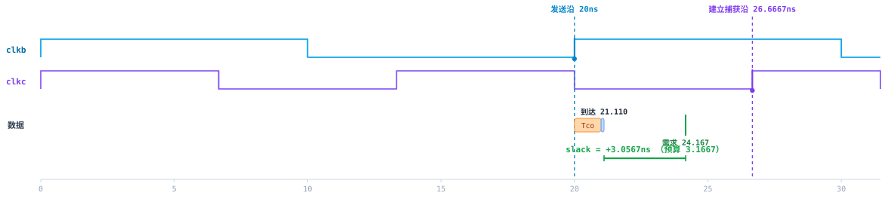
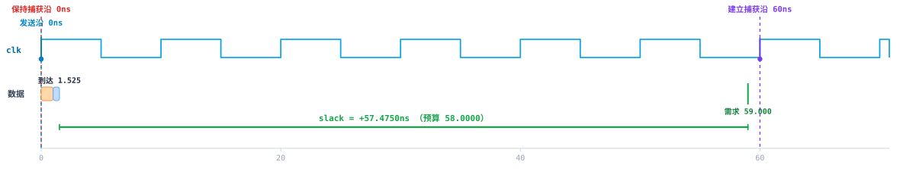
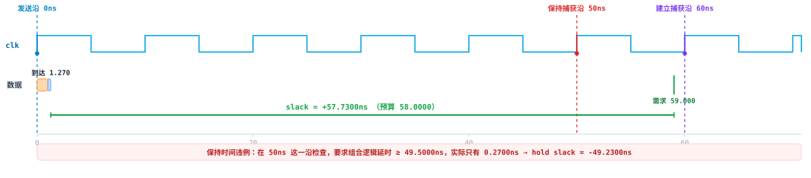

# pysta

**A dependency-free static timing analysis (STA) engine in pure Python.**

[](https://github.com/harryzhang8/pysta/actions/workflows/ci.yml)
[](LICENSE)
[](https://www.python.org/)
[](#install)

`pysta` parses a **Liberty** cell library, a **gate-level Verilog netlist** and a
**Synopsys Design Constraints (SDC)** file, builds a timing graph, enumerates
paths, and computes setup/hold slack — using nothing but the Python standard
library.

It is meant for learning, teaching and testing: you can read the whole engine in
an afternoon, and every number it produces is reproducible by hand.

> [中文文档 / Chinese README](README.zh-CN.md)

**Live demo:** <https://harryzhang8.github.io/pysta/> — the interactive waveform
report, rendered straight from `pysta run`. No install, no build step.

---



<sub>`ex6_multi_clk_out` — `clkb` (10 ns) and `clkc` (40/3 ns) both capture the
same launch. The worst-case pair is launch @ 20 ns → capture @ 26.667 ns, giving
+3.0567 ns. Every diagram in this README is drawn by the engine itself; see
[`tools/export_diagrams.py`](tools/export_diagrams.py).</sub>

---

## Why

Commercial STA tools are closed and huge. If you want to *understand* why
`set_multicycle_path -setup 6` must be paired with `-hold 5`, or why
`[expr 1/75*1000]` silently evaluates to `0` inside an SDC file, you usually end
up reading vendor manuals.

`pysta` reimplements the interesting parts in ~2000 lines of readable Python, so
you can step through them, print intermediate values, and break them on purpose.

---

## Install

```bash
pip install pysta
```

Or run it straight from a checkout — there are **no third-party runtime
dependencies**, only the standard library:

```bash
git clone https://github.com/harryzhang8/pysta
cd pysta
python -m pysta check      # works without installing
```

---

## Quick start

```bash
pysta list                 # what examples are bundled
pysta check                # run every example and verify expected values
pysta report ex9           # print a report_timing-style report
pysta run                  # write reports + an interactive HTML to ./out/
```

`pysta run` produces:

| File | Contents |
|---|---|
| `out/timing_report.txt` | full `report_timing`-style report for every example |
| `out/checks.txt` | expected vs measured table |
| `out/timing_visualization.html` | self-contained SVG timing waveforms + slack bars |

`pysta check` is what CI runs: it exits non-zero if any expectation fails.

---

## Python API

```python
from pysta import Design, analyze
from pysta.paths import DEFAULT_LIB, NETLIST_DIR, SDC_DIR

design = Design.build(
    DEFAULT_LIB,
    NETLIST_DIR / "ex1_reg2reg.v",
    SDC_DIR / "ex1_reg2reg.sdc",
)
result = analyze(design)

for pt in result.worst_setup(3):
    print(f"{pt.path.startpoint} -> {pt.path.endpoint}")
    print(f"  arrival  = {float(pt.arr):.4f} ns")
    print(f"  required = {float(pt.req_setup):.4f} ns")
    print(f"  budget   = {float(pt.budget_setup):.4f} ns")
    print(f"  slack    = {float(pt.slack_setup):+.4f} ns  ({pt.verdict})")
```

All times are `fractions.Fraction`, so they are exact:

```python
from fractions import Fraction
design.sdc.clocks["clkc"].period == Fraction(40, 3)   # True — not 13.333333
```

---

## What is implemented

**Liberty (`.lib`)** — a real subset parser (generic group/attribute grammar),
NLDM 1-D/2-D lookup tables with bilinear interpolation and linear extrapolation,
cell/pin definitions, `ff` groups, setup/hold constraints and clock-to-Q arcs.

**Verilog netlists** — structural gate-level netlists: module ports, buses
(`input [7:0] A;` expands to `A[7]..A[0]`), array instance names (`FF3[0]`),
named and positional connections, and `assign` net aliasing. Behavioral RTL is
rejected with a clear error.

**SDC / Tcl** — `create_clock` (incl. virtual clocks and custom waveforms),
`set_clock_uncertainty`, `set_clock_transition`, `set_clock_latency`,
`set_propagated_clock`, `set_input_delay`, `set_output_delay`, `set_max_delay`,
`set_false_path`, `set_clock_groups`, `set_multicycle_path`, plus
`get_ports` / `get_pins` / `get_clocks` / `get_cells` / `all_clocks` and a Tcl
`expr` evaluator.

**Analysis** — timing graph construction, clock-tree propagation through
buffers, path enumeration between all startpoints and endpoints, worst-case
setup/hold over the **common base period** of all clocks, and reporting.

---

## Examples

The bundled examples each isolate one timing concept and come with an assertion
on the resulting timing budget, so they double as regression tests.

| Example | Concept | Expected budget |
|---|---|---|
| `ex0_clk_attr` | uncertainty / transition / latency modelling | 7.5 ns |
| `ex1_reg2reg` | reg → reg, constrained by `create_clock` alone | 8.0 ns |
| `ex2_in2reg` | `set_input_delay` | 11.6 ns |
| `ex3_reg2out` | `set_output_delay` | 12.6 ns |
| `ex4_in2out` | pure combinational port-to-port path | 18.8 ns |
| `ex5_multi_clk_in` | virtual clock, two launch edges, take the worst | 3.5 ns |
| `ex6_multi_clk_out` | two capture clocks + the `-add_delay` overwrite rule | 3.1667 ns |
| `ex7_async_cdc` | `set_false_path` between asynchronous clocks | 2 paths excluded |
| `ex8_pseudo_path` | logically impossible path, multi-`-through` matching | 2 excluded / 2 kept |
| `ex9_multicycle_adder` | multicycle path, correctly constrained | 58 ns, hold edge 0 ns |
| `ex9b_..._default_hold` | **counter-example**: `-setup 6` without `-hold 5` | hold edge at 50 ns → −49 ns |
| `ex10_multicycle_mixed` | multicycle + single-cycle paths in the same design | 17.9 / 7.9 ns |

Each example ships with three files under `src/pysta/examples/`:
`rtl/*.v` (behavioral intent), `netlist/*.v` (gate-level, what STA analyses) and
`sdc/*.sdc` (constraints, heavily commented).

### The counter-example, side by side

| `-setup 6 -hold 5` → correct | `-setup 6` alone → hold violation |
|---|---|
|  |  |

The left diagram (`ex9`) passes cleanly: setup +57.475 ns, hold +1.025 ns.

In the right diagram (`ex9b`) the only change is the missing `-hold 5`. Setup
still passes by +57.73 ns — so a setup-only flow would call this design clean —
but the hold check has been dragged to the 50 ns edge and now fails by
**−49.23 ns**. That is precisely the class of bug `pysta` exists to make visible.

---

## Design notes

### Clock edge relationship

The single most error-prone piece of logic in the engine. With the launch edge
at `t_L` and `i0` the index of the **first** capture-clock rising edge strictly
after `t_L`:

```
setup capture edge index = i0 + (M_setup - 1)
hold  capture edge index = setup capture edge index - 1 - M_hold
```

`M_setup` defaults to 1 and `M_hold` to 0, so setup checks on the next edge and
hold checks *on the same edge as the launch* — which is what "hold is analysed
one clock edge before setup" really means.

Substituting `set_multicycle_path -setup 6` (M_setup=6, M_hold=0) on a 10 ns
clock puts the setup edge at 60 ns **and drags the hold edge to 50 ns**. Adding
`-hold 5` pulls it back to `6 - 1 - 5 = 0`. See
[docs/multicycle-edge-relationships.md](docs/multicycle-edge-relationships.md).

### Common base period

With several clocks, the engine walks **every** launch edge inside
`LCM(T1, T2, ...)` and keeps the worst slack:

* `LCM(30, 20) = 60 ns` → launch edges {0, 30}, worst pair is 30 → 40.
* `LCM(20, 40/3, 10) = 40 ns` → worst pair is 20 → 80/3.

This is why "just subtract the two periods" gives the wrong answer.

### Exact rational arithmetic

Periods, latencies and delays are `Fraction`, never `float`. `1.0/75*1000`
yields exactly `40/3`, so `40/3 * 3 == 40`. A float implementation would give
`39.99999999999999` and produce a subtly wrong base period.

### Tcl integer division

`expr` deliberately keeps Tcl's semantics: `1/75` is integer division and yields
`0`, while `1.0/75` is floating point. This is a classic silent SDC bug, so the
evaluator tracks whether a value is an integer and truncates accordingly.

### `-add_delay` semantics

```tcl
set_output_delay -max 2.5 -clock clkc [get_ports B]
set_output_delay -max 4.5 -clock clkd -add_delay [get_ports B]
```

Without `-add_delay` the second command *replaces* the first. The parser
implements that rule and warns when it happens; the analyzer evaluates **every
remaining constraint separately** and keeps the worst one. In `ex6` the binding
constraint comes from `clkc` (2.5 ns), not from the larger 4.5 ns of `clkd`.

### Cell delay is load-dependent

`Tco` is looked up from the same NLDM table as any combinational arc, so it grows
with fanout. In `ex10`, `FF1/Q` drives two sinks, so `Tco` becomes 1.1 ns instead
of 1.0 ns and the 2-cycle budget is 17.9 ns rather than the naive 18.0 ns.

---

## Limitations

`pysta` is a teaching engine, **not** a replacement for PrimeTime/OpenSTA.

| | pysta | Production STA |
|---|---|---|
| Delay model | cell tables + wire-load model (default: ideal wires) | + extracted parasitics (SPEF) |
| Clock tree | SDC latency numbers; no real propagation | propagated from the actual tree |
| Path search | exhaustive simple-path enumeration | timing-graph worst-path algorithms |
| Timing arcs | mostly max/setup, hold for register endpoints | full max/min, separate rise/fall |
| Optimisation | none — it only reports | resizing, buffering, retiming |
| Crosstalk / SI | not modelled | full SI analysis |

Do not use it to sign off a real design.

---

## Development

```bash
pip install -e ".[dev]"
pytest                      # 137 tests
pysta check                 # 32 expectation checks
```

### Refreshing the diagrams

The SVGs in `docs/images/` are generated, not hand-drawn:

```bash
python tools/export_diagrams.py    # 5 diagrams -> docs/images/*.svg
python -m pysta run --out docs/demo  # full interactive report -> docs/demo/
```

### Optional: real synthesis and simulation

`tools/rtl_check.py` runs `iverilog` (syntax) and `yosys` (actual synthesis)
over every RTL file, which also proves the examples are synthesizable:

```bash
python tools/fetch_oss_cad_suite.py    # downloads oss-cad-suite (~570 MB, portable)
python tools/rtl_check.py              # iverilog + yosys, 11/11 pass
```

> **Windows caveat**: the yosys/abc binaries in oss-cad-suite misbehave when
> their install path contains non-ASCII characters. `fetch_oss_cad_suite.py`
> therefore installs to `%LOCALAPPDATA%\pysta-tools\oss-cad-suite`, and
> `rtl_check.py` copies sources into an ASCII staging directory before running.

---

## Contributing

Issues and pull requests are welcome. Useful starting points:

* More SDC commands (`create_generated_clock`, `set_case_analysis`, `set_disable_timing`)
* `min`-delay / hold-only analysis for output paths
* A generated-clock and clock-divider example
* Translating the code comments (currently Chinese)

Please run `pytest` and `pysta check` before opening a PR.

---

## License

[Apache License 2.0](LICENSE) © 2026 harryzhang8
